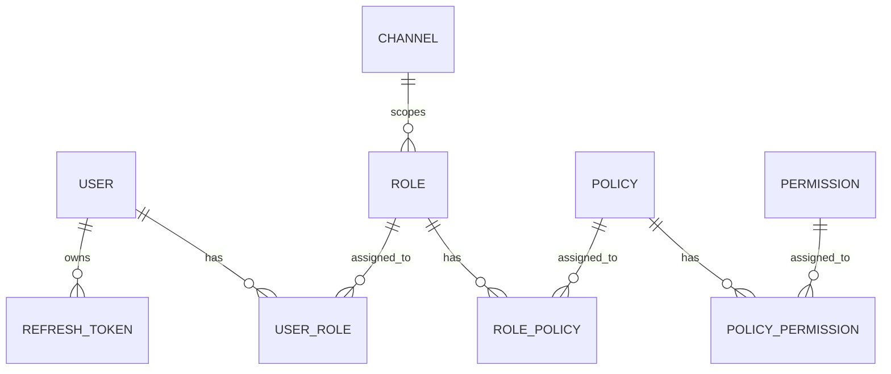

# Backend

Authentication and RBAC API for the Auth Service. Built with Express, TypeScript, Sequelize, and PostgreSQL.

## Overview

The backend exposes a REST API for authentication (login, token refresh, logout, introspection) and for managing the RBAC model: users, roles, policies, permissions, and channels. Requests are authenticated with a JWT bearer token and gated by an API key that also determines the scope (global or a specific channel).

## Tech Stack

- Node.js
- Express 5
- TypeScript
- PostgreSQL
- Sequelize + sequelize-typescript (ORM)
- Sequelize CLI (migrations & seeders)
- JSON Web Tokens (`jsonwebtoken`)
- bcrypt (password hashing)
- express-validator (request validation)
- swagger-jsdoc + swagger-ui-express (API docs)
- Jest + Supertest (testing)
- ESLint, Prettier, Knip

## Folder Structure

```
auth-service-be/
├── src/
│   ├── config/           # Sequelize / database configuration
│   ├── constants/        # Shared constants and enums
│   ├── controllers/      # Request handlers
│   ├── database/
│   │   ├── migrations/   # Schema migrations
│   │   ├── models/       # Sequelize models
│   │   └── seeders/      # Seed data (e.g. superadmin)
│   ├── docs/             # OpenAPI base definition
│   ├── middlewares/      # Auth, API key, validation, error handling
│   ├── routes/           # Route definitions (with OpenAPI annotations)
│   ├── services/         # Business logic
│   ├── types/            # Type declarations / augmentations
│   ├── utils/            # Helpers
│   ├── validators/       # express-validator schemas
│   ├── app.ts            # Express app wiring
│   └── server.ts         # Entry point
├── tests/                # Jest test suites
└── dist/                 # Compiled output
```

## System Architecture

A layered request pipeline:

**Route → Middleware → Controller → Service → Model (Sequelize) → PostgreSQL**

- **Routes** declare endpoints and attach validators and middleware.
- **Middleware** verifies the bearer token, checks the API key / scope, runs validation, and handles errors centrally.
- **Controllers** parse requests and shape responses.
- **Services** hold business logic and database access.
- **Models** map to PostgreSQL tables via Sequelize.

The API is self-documenting through OpenAPI annotations, served at `/api-docs`.

## Modules

| Module | Responsibility |
| --- | --- |
| Auth | Login, token refresh, logout, `me`, token verification, permission checks |
| Users | User CRUD and lifecycle |
| Roles | Role CRUD; roles are scoped global or per channel |
| Policies | Policy CRUD; groups of permissions |
| Permissions | Permission CRUD; the atomic access units |
| Channels | Channel CRUD; scopes roles to a specific application |
| User-Role | Assigns roles to users |
| Role-Policy | Attaches policies to roles |
| Policy-Permission | Attaches permissions to policies |

## Authentication & Authorization

- **Login** (`POST /api/auth/generate-token`) verifies email/password and returns the user, a flattened permission list for the current scope, and an access/refresh token pair.
- **Access tokens** are short-lived JWTs sent as `Authorization: Bearer <token>`.
- **Refresh tokens** are longer-lived and single-use — rotated on every refresh (`POST /api/auth/refresh-token`).
- **Logout** (`POST /api/auth/destroy-token`) revokes a refresh token.
- **API key** (`x-api-key` header) is required on protected routes and sets the scope: `global` or a specific channel.
- **Permission checks** are available via `GET /api/auth/has-any-permission`.

> Token TTLs and other tunables are defined in code/config — see `src/` for exact values.

## Database Design

### Database Engine
PostgreSQL.

### ORM
Sequelize with `sequelize-typescript` (decorator-based models). Migrations and seeders are managed through the Sequelize CLI.

### Naming Conventions
- **Tables:** `snake_case`, plural for entities (`users`, `roles`, `policies`, `permissions`, `channels`, `refresh_tokens`) and singular for join tables (`user_role`, `role_policy`, `policy_permission`).
- **Columns:** `snake_case`.
- **Models:** `PascalCase`, singular (`User`, `Role`, `Policy`).

### Core Model

- A **User** can hold many **Roles**; a **Role** can belong to many Users.
- A **Role** can hold many **Policies**; a **Policy** can belong to many Roles.
- A **Policy** can hold many **Permissions**; a **Permission** can belong to many Policies.
- A **Channel** scopes many **Roles** (a role is global when it has no channel).
- A **User** owns many **RefreshTokens**.

### Entity Relationship Diagram (ERD)



## Environment Variables

| Variable | Description |
| --- | --- |
| `PORT` | Port the server listens on (e.g. `4000`) |
| `NODE_ENV` | Runtime environment (`development`, `production`, …) |
| `API_KEY` | API key required by protected routes |
| `ACCESS_SECRET` | JWT signing secret for access tokens (required, no default) |
| `REFRESH_SECRET` | JWT signing secret for refresh tokens (required, no default) |
| `DB_HOST` | PostgreSQL host |
| `DB_NAME` | Database name |
| `DB_USERNAME` | Database user |
| `DB_PASSWORD` | Database password |
| `SUPERADMIN_EMAIL` | Seeded superadmin email |
| `SUPERADMIN_USERNAME` | Seeded superadmin username |
| `SUPERADMIN_PASSWORD` | Seeded superadmin password |

Generate secrets with: `openssl rand -hex 32`. See `.env.example` for a template.

## Getting Started

### Prerequisites
- Node.js
- PostgreSQL (a reachable database)

### Installation

```bash
npm install
cp .env.example .env   # then fill in the values
```

### Database Setup

```bash
npm run migrate        # apply migrations
npm run seed           # seed initial data (e.g. superadmin)
```

### Development

```bash
npm run dev            # start with hot reload (nodemon + ts-node)
```

### Production Build

```bash
npm run build          # compile TypeScript to dist/
npm start              # run the compiled server
```

The API docs are available at `/api-docs` and the raw spec at `/api-docs.json`.

## Available Scripts

| Script | Description |
| --- | --- |
| `npm run dev` | Start the dev server with hot reload |
| `npm run build` | Compile TypeScript to `dist/` |
| `npm start` | Run the compiled server |
| `npm test` | Run the Jest test suite |
| `npm run test:verbose` | Run tests with verbose, non-silent output |
| `npm run lint` | Lint `.ts` files |
| `npm run lint:fix` | Lint and auto-fix |
| `npm run format` | Format `src` and `tests` with Prettier |
| `npm run knip` | Find unused files, exports, and dependencies |
| `npm run migrate` | Run Sequelize migrations for `$NODE_ENV` |
| `npm run seed` | Run all seeders |
| `npm run seed:undo` | Revert all seeders |

## API Documentation

The API is documented with **Swagger / OpenAPI**, generated from `@openapi` annotations on the route files (`swagger-jsdoc` + `swagger-ui-express`).

| Endpoint | Description |
| --- | --- |
| `GET /api-docs` | Interactive Swagger UI |
| `GET /api-docs.json` | Raw OpenAPI spec (JSON) |

Once the server is running, open [http://localhost:4000/api-docs](http://localhost:4000/api-docs) (adjust the port to match `PORT`). The docs are served without authentication, since this is an internal service. When adding routes, document them with `@openapi` annotations so they appear automatically.

## Health Checks

| Endpoint | Purpose |
| --- | --- |
| `GET /ping` | Liveness — process is responsive (no DB call) |
| `GET /health` | Readiness — verifies the database connection |

## Coding Guidelines

- **Controllers** handle HTTP concerns only; keep business logic in **services**.
- **Validators** (express-validator) live in `src/validators/`, one folder per domain.
- **Models** are `PascalCase` singular; database tables are `snake_case`.
- Document new routes with `@openapi` annotations so they appear in Swagger.
- Run `npm run lint` and `npm run format` before committing.

## Deployment

TODO: Document the deployment target and process. At a minimum: provision PostgreSQL, set environment variables, run `npm run build`, apply migrations (`npm run migrate`), and start with `npm start`.

## Troubleshooting

| Issue | Likely cause / fix |
| --- | --- |
| `503` from `/health` | Database unreachable — check `DB_*` variables and that PostgreSQL is running |
| `403` on requests | Missing or invalid `x-api-key` header |
| `401` on requests | Missing, invalid, or expired bearer token |
| Server won't start | `ACCESS_SECRET` / `REFRESH_SECRET` not set |
| Migrations fail | Wrong `NODE_ENV` or database credentials; confirm the DB exists |
